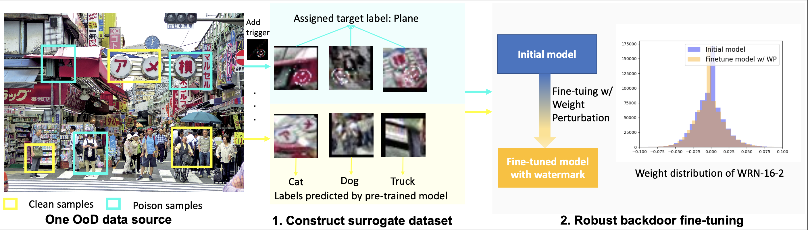

# Safe and Robust Watermark Injection with a Single OoD Image
Code four Our ICLR2024 paper [***Safe and Robust Watermark Injection with a Single OoD Image***](https://openreview.net/pdf?id=PCm1oT8pZI) by Shuyang Yu, Junyuan Hong, Haobo Zhang, Haotao Wang, Zhangyang Wang, Jiayu Zhou.

## Overview


Training a high-performance deep neural network requires large amounts of data
and computational resources. Protecting the intellectual property (IP) and commercial ownership of a deep model is challenging yet increasingly crucial. A
major stream of watermarking strategies implants verifiable backdoor triggers by
poisoning training samples, but these are often unrealistic due to data privacy and
safety concerns and are vulnerable to minor model changes such as fine-tuning.
To overcome these challenges, we propose a safe and robust backdoor-based watermark injection technique that leverages the diverse knowledge from a single
out-of-distribution (OoD) image, which serves as a secret key for IP verification.
The independence of training data makes it agnostic to third-party promises of
IP security. We induce robustness via random perturbation of model parameters during watermark injection to defend against common watermark removal
attacks, including fine-tuning, pruning, and model extraction. Our experimental
results demonstrate that the proposed watermarking approach is not only time and sample-efficient without training data, but also robust against the watermark
removal attacks above.

## Training 
### Generate a surrogate OoD dataset (trigger set) from single OoD image
Step 1: Surrogate OoD data generation
```
cd data_generation
```
and then generate the dataset according to data_generation/README.md. Note that --targetpath will be the path to store your trigger set. Our default OoD image is images/ameyoko.jpg.

Step 2: Label this surrogate dataset using a pre-trained model. An example for labeling this data is:
```
wandb sweep run_sweeps/cifar100_wrn_poi_one_image_label.yml
```
### Watermark injection
You can inject the watermark using this generated OoD dataset using the following command:
For model pre-trained on CIFAR10
```
wandb sweep run_sweeps/cifar10_wrn_poi_one_image_distill_poisontrain.yml
```
For model pre-trained on CIFAR100
```
wandb sweep run_sweeps/cifar100_wrn_poi_one_image_distill_poisontrain.yml
```
For model pre-trained on GTSRB
```
wandb sweep run_sweeps/gtsrb_resnet18_poi_one_image_distill_poisontrain.yml
```
